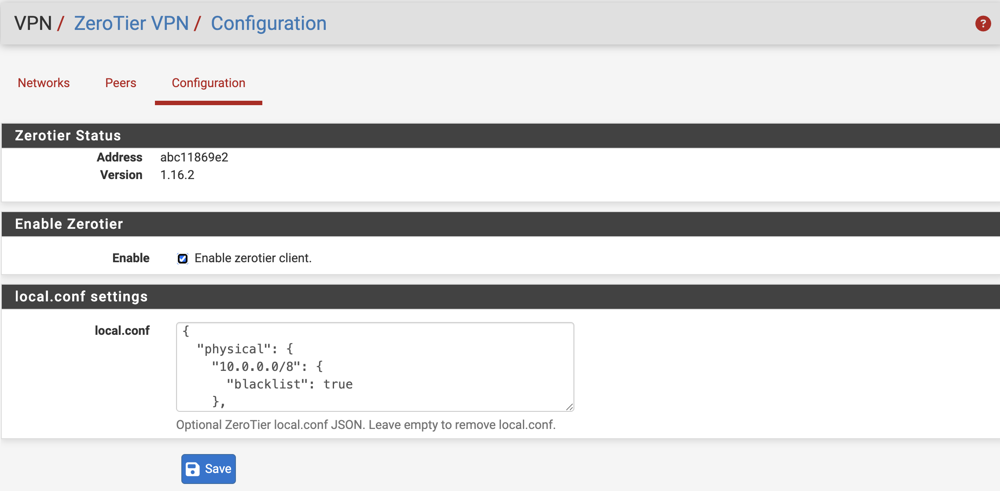

# ZeroTier for pfSense


ZeroTier VPN integration for pfSense with native WebGUI support.

## Introduction

ZeroTier is a secure peer-to-peer (P2P) virtual networking platform that enables devices to communicate seamlessly across LAN and WAN environments, providing capabilities similar to enterprise-grade SDN solutions.

Since pfSense does not officially provide a ZeroTier package, this project integrates a complete ZeroTier management interface directly into the pfSense WebGUI. Users can manage the ZeroTier service, join networks, and monitor node status directly from the pfSense dashboard.



Tested successfully on:

- pfSense CE 2.8.1 (FreeBSD 15)
- pfSense Plus 26.03.1 (FreeBSD 16)
---
## Features
- WebGUI management
- Node status monitoring
- Route advertisement support
- Automatic startup on boot
- Join ZeroTier networks
- ZeroTier service management
- Supports both pfSense CE and Plus

---
## Project Layout

Installed pfSense files are stored under the same paths they use on the firewall:

```text
src/usr/local/www/                         WebGUI PHP pages
src/usr/local/bin/                         FreeBSD ZeroTier package payload inputs
src/usr/local/pkg/                         pfSense package XML and PHP include
src/usr/local/etc/rc.d/zerotier.sh         pfSense package service wrapper
src/usr/local/share/pfSense/menu/          WebGUI menu entry
```

---
## Installation
Upload the package to pfSense:

```shell
/root/pfSense-pkg-zerotier-1.16.2.pkg
```

Login to pfSense via SSH and execute:

```shell
pkg add pfSense-pkg-zerotier-1.16.2.pkg
```

After installation, the following menu will appear in WebGUI:

```text
VPN -> ZeroTier VPN
```
---
## Uninstall
```shell
pkg delete pfSense-pkg-zerotier
```
---
## Enable ZeroTier

Navigate to:

```text
VPN -> ZeroTier VPN
```

Enable:

```text
Enable Zerotier Client
```
Save the configuration to start the service.

---
## Optional local.conf Settings

Navigate to:

```text
VPN -> ZeroTier VPN -> Configuration
```

Enter optional ZeroTier `local.conf` JSON in the `local.conf` field. Leave it empty to remove `local.conf`.

The value must be a valid JSON document, otherwise ZeroTier may fail to start.

---
## Join a ZeroTier Network

Navigate to:

```text
VPN -> ZeroTier VPN -> Networks
```

Click:

```text
Join
```

Enter:

```text
Network ID
```
Save the configuration.

---
## Node Authorization

After joining a network for the first time, the node will remain unauthorized by default.

Login to ZeroTier Central:

https://my.zerotier.com

Open your network and go to:

```text
Members
```

Find the newly added pfSense node and:

- Check `Authorized`
- Set a node name
- Assign an IP address
- Click `Save`

Once authorized, the ZeroTier network status in pfSense will display:

```text
OK
```
---
## Route Management
To allow ZeroTier clients to access networks behind pfSense, add Managed Routes in ZeroTier Central.

Example:
```text
Destination: 192.168.1.0/24
Via: 10.147.20.2
```
Where:

- `Destination` is the pfSense LAN subnet
- `Via` is the pfSense ZeroTier IP address

After configuration, remote ZeroTier clients can access LAN resources behind pfSense.

---
## Firewall Rules
To allow LAN clients to access remote ZeroTier networks, appropriate firewall rules must be added.

Example:

```text
Interface: LAN
Source: LAN net
Destination: any
Action: Pass
```

You may also restrict access to specific ZeroTier subnets if needed.

---
## View Peer Status
Navigate to:

```text
VPN -> ZeroTier VPN -> Peers
```

Available information includes:

- Peer status
- Latency
- Connection method
- Routing information
- Node details

---
## Uninstall
Execute:

```shell
pkg remove pfSense-pkg-zerotier
```
---

## Connectivity Testing
After configuration, it is recommended to test connectivity using:

```shell
ping
```
Ensure communication between ZeroTier nodes is working properly.

---
## Notes
- Do NOT manually assign the ZeroTier interface under `Interfaces -> Assignments`, otherwise network settings may be reset after reboot.
- The package already includes startup scripts. Do NOT add startup commands using Shellcmd, otherwise pfSense may freeze during boot and fail to start correctly.

## Disclaimer
> [!CAUTION]
> This is an unofficial plugin and is not supported by Netgate or the pfSense team. Users assume all risks and consequences.
