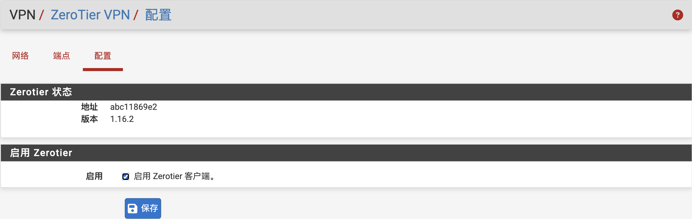

# pfSense ZeroTier Package

适用于 pfSense 的 ZeroTier Web 管理插件。

## 项目简介

ZeroTier 是一个基于加密安全全球对等网络（P2P）的分布式网络虚拟化平台，可实现跨局域网与广域网的设备互联，并提供接近企业级 SDN 的网络管理能力。

由于 pfSense 官方尚未提供 ZeroTier 插件，本项目为 pfSense 开发了完整的 ZeroTier Web 管理界面，可直接在 pfSense WebGUI 中完成服务管理、网络加入及节点状态查看等操作。



以下环境测试通过：

- pfSense CE 2.8.1（FreeBSD 15）
- pfSense Plus 26.03.1（FreeBSD 16）

## 功能特性

- WebGUI 管理
- 节点状态查看
- 支持路由发布
- 开机自动启动
- 加入Zerotier网络
- ZeroTier 服务管理
- 支持 pfSense CE 与 Plus

---

## 安装插件

上传安装包到 pfSense：

```shell
/root/pfSense-pkg-zerotier-1.16.2.pkg
```

通过 SSH 登录 pfSense，执行：

```shell
pkg add pfSense-pkg-zerotier-1.16.2.pkg
```

安装完成后即可在 WebGUI 中看到：

```text
VPN -> ZeroTier VPN
```

---

## 启用 ZeroTier

进入：

```text
VPN -> ZeroTier VPN
```

勾选：

```text
Enable Zerotier Client
```

保存配置即可启动服务。

---

## 加入 ZeroTier 网络

进入：

```text
VPN -> ZeroTier VPN -> Networks
```

点击：

```text
Join
```

填写：

```text
Network ID
```

保存即可。

---

## 节点授权

首次加入网络后，节点默认处于未授权状态。

登录 ZeroTier Central：

https://my.zerotier.com

进入对应网络：

```text
Members
```

找到新加入的 pfSense 节点后：

- 勾选 Authorized
- 设置节点名称
- 分配 IP 地址
- 点击 Save

授权完成后，pfSense 中 ZeroTier 网络状态将显示为：

```text
OK
```

---

## 路由管理

如果需要让 ZeroTier 网络访问 pfSense 后方局域网，需要在 ZeroTier Central 中添加 Managed Routes。

例如：

```text
Destination: 192.168.1.0/24
Via: 10.147.20.2
```

其中：

- Destination 为 pfSense LAN 网段
- Via 为 pfSense ZeroTier 地址

配置完成后即可访问 pfSense 后方网络资源。

---

## 防火墙规则

为了让 LAN 客户端访问远程 ZeroTier 网络，需要添加相应防火墙规则。

示例：

```text
Interface: LAN
Source: LAN net
Destination: any
Action: Pass
```
也可根据实际情况限制为指定 ZeroTier 网段。

---

## 查看节点状态

进入：

```text
VPN -> ZeroTier VPN -> Peers
```
可查看：
- 节点状态
- 延迟数据
- 连接方式
- 路由情况
- 节点信息
---

## 卸载插件

执行：
```shell
pkg remove pfSense-pkg-zerotier
```
---

## 测试连接

建议完成配置后使用 ping 命令确认各节点之间网络通信正常。

---

## 注意事项

- 请勿在：接口 -> 分配 菜单手动分配 ZeroTier 接口，会导致系统重启后网络设置被重置。
- 安装包已包含开机启动脚本，请勿通过 Shellcmd 添加启动命令，会导致 pfSense 启动卡死，系统无法正常引导。

---

## 兼容性

|         平台          | 状态  |
|----------------------|------|
| pfSense CE 2.8.1     |  ✅  |
| pfSense Plus 26.03.1 |  ✅  |

---

